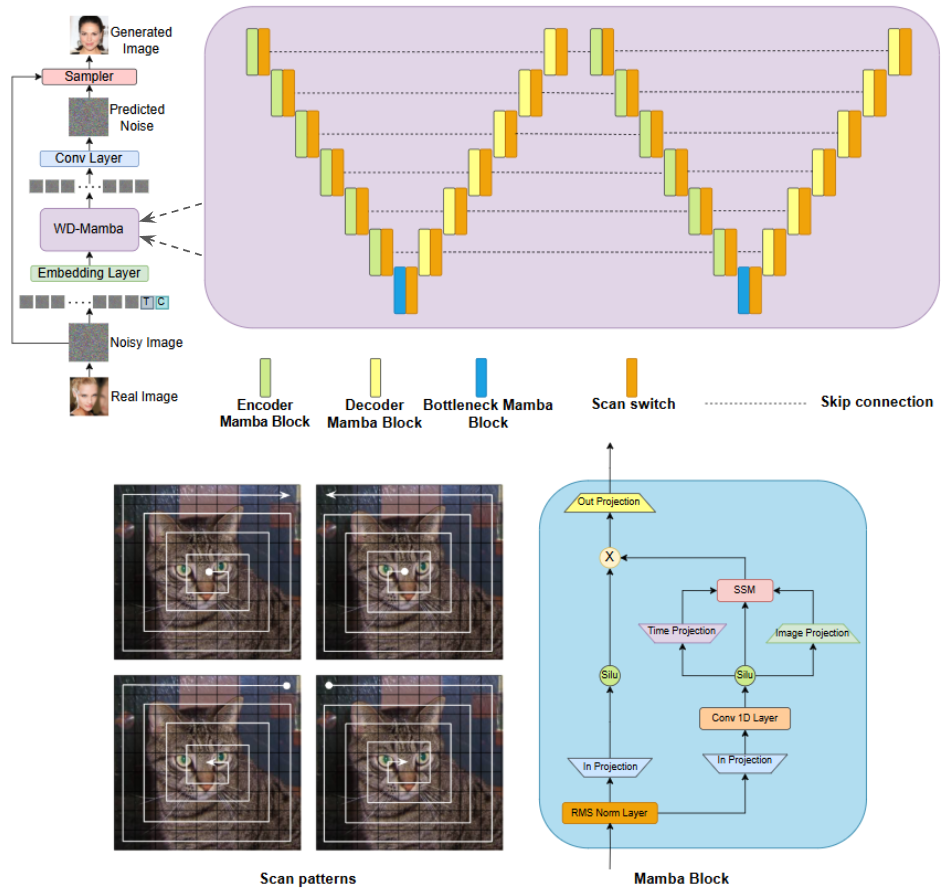
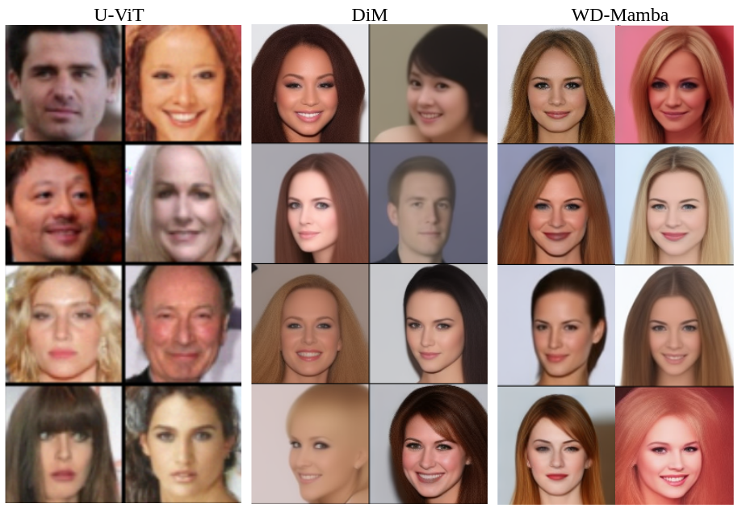
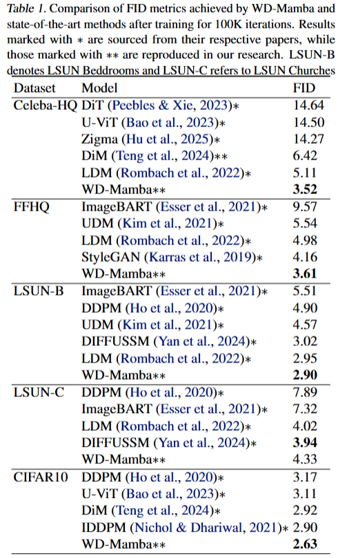
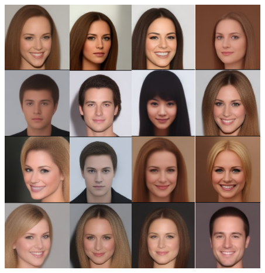
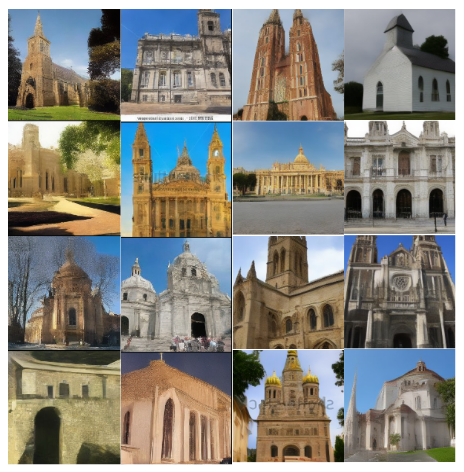

# WD-Mamba: A W-Mamba Diffusion Model for Enhancing Image Synthesis

## WD-Mamba Model Architecture

- We develop the WD-Mamba modedl for synthesis of high resolution images. 

<div align="center">
    
    <p>The left section of the above figure illustrates overall generative process. The middle section shows the WD-Mamba encoder-decoder architecture. The bottom left highlights the spiral scan patterns, while the bottom right details the core Mamba block.</p>
</div>

## Qualitative results of WD-Mamba

<div align="center">
    
    <p>The figure above shows the comparison of generated images on CelebAHQ dataset with dfferent state-of-the-art models.</p>
</div>

## Quantitative results of WD-Mamba

<div align="center">
    
    <p>The figure above shows the comparison of FID values of generated images on several datasets with dfferent state-of-the-art models.</p>
</div>

## More Generated Images by WD-Mamba

<div align="center">
    
    <p>The figure above shows generated images on CelebAHQ dataset.</p>
</div>

<div align="center">
    
    <p>The figure above shows generated images on FFHQ dataset.</p>
</div>

<div align="center">
    
    <p>The figure above shows generated images on LSUN Bedrooms dataset.</p>
</div>

<div align="center">
    
    <p>The figure above shows generated images on LSUN Churches dataset.</p>
</div>

## Training

#### CelebAHQ dataset
```shell script
accelerate launch --multi_gpu --gpu_ids 0,1 --main_process_port 20019 --num_processes 2 --mixed_precision bf16 ./train_ldm_uncond.py --config=configs/celeba_wvit.py
```

#### FFHQ dataset
```shell script
accelerate launch --multi_gpu --gpu_ids 0,1 --main_process_port 20019 --num_processes 2 --mixed_precision bf16 ./train_ldm_uncond.py --config=configs/ffhq_wvit.py
```
#### LSUN-Bedrooms dataset
```shell script
accelerate launch --multi_gpu --gpu_ids 0,1 --main_process_port 20019 --num_processes 2 --mixed_precision bf16 ./train_ldm_uncond.py --config=configs/lsun_beds_wvit.py
```

#### LSUN-Churches dataset
```shell script
accelerate launch --multi_gpu --gpu_ids 0,1 --main_process_port 20019 --num_processes 2 --mixed_precision bf16 ./train_ldm_uncond.py --config=configs/lsun_churches_wvit.py
```

#### CIFAR10 dataset
```shell script
accelerate launch --multi_gpu --gpu_ids 0,1 --main_process_port 20019 --num_processes 2 --mixed_precision bf16 ./train.py --config=configs/cifar10_wvit.py
```

## Evaluation

#### CelebAHQ dataset
```shell script
accelerate launch --multi_gpu --gpu_ids 0,1 --main_process_port 20029 --num_processes 2 --mixed_precision bf16 ./eval_ldm_uncond.py --config=configs/celeba_wvit.py --nnet_path <path for saved checkpoint>
```

#### FFHQ dataset
```shell script
accelerate launch --multi_gpu --gpu_ids 0,1 --main_process_port 20019 --num_processes 2 --mixed_precision bf16 ./eval_ldm_uncond.py --config=configs/ffhq_wvit.py --nnet_path <path for saved checkpoint>
```
#### LSUN-Bedrooms dataset
```shell script
accelerate launch --multi_gpu --gpu_ids 0,1 --main_process_port 20019 --num_processes 2 --mixed_precision bf16 ./eval_ldm_uncond.py --config=configs/lsun_beds_wvit.py --nnet_path <path for saved checkpoint>
```

#### LSUN-Churches dataset
```shell script
accelerate launch --multi_gpu --gpu_ids 0,1 --main_process_port 20019 --num_processes 2 --mixed_precision bf16 ./eval_ldm_uncond.py --config=configs/lsun_churches_wvit.py --nnet_path <path for saved checkpoint>
```

#### CIFAR10 dataset
```shell script
accelerate launch --multi_gpu --gpu_ids 0,1 --main_process_port 20019 --num_processes 2 --mixed_precision bf16 ./eval.py --config=configs/cifar10_wvit.py --nnet_path <path for saved checkpoint>
```

